<div align="center">

# 🚀 Enterprise Data Science & Machine Learning Portfolio
### *A Production-Grade Suite of 20 End-to-End Projects Across 10+ Business Verticals*

[](https://www.python.org/)
[](https://jupyter.org/)
[](https://scikit-learn.org/)
[](https://xgboost.readthedocs.io/)
[](https://lightgbm.readthedocs.io/)
[](https://opensource.org/licenses/MIT)
[](./scripts/verify_portfolio.py)

<p align="center">
  <b>Bridging the Gap Between Academic Machine Learning and Production Business ROI</b><br>
  <i>Every project features self-contained domain datasets, rigorous cross-validation, asymmetric cost matrices, model explainability (SHAP), and executive decision frameworks.</i>
</p>

[🌐 Live Interactive Visualizer](./portfolio_website) • [Browse Projects](#-master-project-catalog) • [Architecture](#-data-science-methodology-framework) • [Quickstart](#-quickstart--reproduction) • [Key Highlights](#-standout-project-spotlights)

---

</div>

## 🌐 Interactive Web Visualizer Dashboard

This portfolio includes a **bespoke, developer-crafted Web Visualizer** located in [`portfolio_website/`](./portfolio_website) (and deployed to [`docs/`](./docs) for GitHub Pages).

- **Interactive Dashboard:** Browse all 20 projects with real-time multi-attribute search and domain filters.
- **Dynamic Logic Simulators:** Live Decision Threshold sliders ($\tau$) updating Confusion Matrices & asymmetric cost live; Pricing Elasticity response surfaces; Safety Stock inventory buffers; and GNN Graph physics.
- **Algorithm Deconstructions:** Mathematical formulations, step-by-step logic, and comparative multi-model benchmark tables.
- **Zero Build Friction:** Opens directly in your browser or can be served locally with:
  ```bash
  python -m http.server 3000 --directory portfolio_website
  ```
  *(Then open `http://localhost:3000` in your browser)*

## 📌 Executive Overview

This repository houses a comprehensive collection of **20 industry-grade data science and machine learning projects** organized from **Beginner** to **Intermediate** and **Advanced** tiers. Rather than generic tutorials (Titanic, Boston Housing, Iris), every project in this portfolio tackles a concrete, high-stakes operational problem across domains including:

- 🏥 **Healthcare & Clinical Diagnostics** (ER triage disposition, Framingham/SHAP cardiac risk, Chest X-Ray Grad-CAM)
- 💳 **Fintech & Quantitative Finance** (Fair credit risk auditing, GARCH/FinBERT volatility, GNN fraud rings)
- 🛍️ **E-Commerce & Growth Analytics** (RFM/CLV cohort clustering, Log-Log dynamic price elasticity)
- 📦 **Supply Chain & Logistics** (Multi-echelon demand forecasting, RL fleet dispatch optimization)
- 🛡️ **Cybersecurity & Trust/Safety** (Lexical URL entropy detection, OOD intent routing)
- ⚡ **Clean Energy & Remote Sensing** (EV charging desert clustering, Sentinel-2 multispectral crop segmentation)
- ⚙️ **Industrial IoT** (Sensor telemetry remaining useful life degradation)
- 🤖 **Enterprise Generative AI** (SEC 10-K RAG with automated hallucination & faithfulness auditing)

---

## 🗺️ Data Science Methodology Framework

Every project adheres to a standardized, production-level analytical lifecycle:

```mermaid
flowchart LR
    A["Business Objective & Asymmetric Cost Framing"] --> B["Data Ingestion & Integrity Audit"]
    B --> C["Exploratory Data Analysis & Statistical Tests"]
    C --> D["Leakage-Free Feature Engineering Pipeline"]
    D --> E["Multi-Model Benchmarking (Baseline ➔ Ensemble ➔ Deep)"]
    E --> F["Cost-Sensitive Threshold Tuning (FP vs FN)"]
    F --> G["Model Explainability (SHAP / Feature Attribution)"]
    G --> H["Executive Recommendations & Production Takeaways"]
```



---

## 📊 Master Project Catalog

### 🟢 Level 1: Beginner Tier (Foundational Analytics, EDA & Interpretable ML)
*Focus: Data cleaning, exploratory data analysis, hypothesis testing, feature creation, baseline machine learning, and business storytelling.*

| # | Project Name | Business Domain | Primary Stack | Key Benchmark Metric | Quick Links |
|:---:|:---|:---:|:---|:---|:---:|
| **01** | **ER Triage & Length of Stay Optimization** | Healthcare | `Logistic Regression`, `Random Forest` | Sensitivity: **92.4%**, ROC-AUC: **0.908** | [README](./01_healthcare_er_triage) • [Notebook](./01_healthcare_er_triage/01_er_triage_analysis.ipynb) |
| **02** | **Credit Risk Scoring & Algorithmic Fairness Audit** | Fintech | `WOE/IV`, `Random Forest`, `Fairlearn` | Disparate Impact: **0.895**, ROC-AUC: **0.854** | [README](./02_fintech_credit_risk_fairness) • [Notebook](./02_fintech_credit_risk_fairness/02_credit_risk_fairness.ipynb) |
| **03** | **Customer Lifetime Value (CLV) & RFM Segmentation** | E-Commerce | `RFM`, `K-Means`, `Agglomerative` | Silhouette Score: **0.584**, $k=4$ Clusters | [README](./03_ecommerce_clv_rfm_segmentation) • [Notebook](./03_ecommerce_clv_rfm_segmentation/03_clv_rfm_segmentation.ipynb) |
| **04** | **EV Charging Deserts & Spatial Infrastructure** | Clean Energy | `Geospatial`, `K-Means`, `DBSCAN` | Isolated Deserts ($Noise=-1$), Deficit Ratio | [README](./04_energy_ev_charging_deserts) • [Notebook](./04_energy_ev_charging_deserts/04_ev_charging_deserts.ipynb) |
| **05** | **Player Valuation & Tactical Role Discovery** | Sports Analytics | `PCA`, `t-SNE`, `OLS`, `Ridge`, `Lasso` | Test $R^2$: **0.829**, RMSE: **€7.51M** | [README](./05_sports_player_valuation_roles) • [Notebook](./05_sports_player_valuation_roles/05_sports_player_valuation.ipynb) |
| **06** | **Audio Features & Song Skip Propensity** | Streaming Media | `SMOTE`, `Cost-Sensitive Random Forest` | PR-AUC: **0.751**, Brier Score: **0.118** | [README](./06_entertainment_audio_skip_prediction) • [Notebook](./06_entertainment_audio_skip_prediction/06_audio_skip_prediction.ipynb) |

---

### 🟡 Level 2: Intermediate Tier (Feature Engineering, Time Series, NLP & Explainable AI)
*Focus: Non-trivial temporal features, NLP transfer learning, tree ensembles, class imbalance, and model explainability (SHAP).*

| # | Project Name | Business Domain | Primary Stack | Key Benchmark Metric | Quick Links |
|:---:|:---|:---:|:---|:---|:---:|
| **07** | **Multi-Store Inventory Forecasting & Stockout Risk** | Supply Chain | `TimeSeriesSplit`, `LightGBM`, Lags | WAPE: **11.4%**, Stockout: **2.1%** | [README](./07_logistics_inventory_forecasting) • [Notebook](./07_logistics_inventory_forecasting/07_inventory_demand_forecasting.ipynb) |
| **08** | **Financial News Sentiment & Volatility Forecasting** | Quantitative Finance | `FinBERT`, `GARCH`, `LightGBM` | Volatility RMSE: **0.0248**, Return Corr | [README](./08_finance_news_sentiment_volatility) • [Notebook](./08_finance_news_sentiment_volatility/08_news_sentiment_volatility.ipynb) |
| **09** | **Cardiovascular Disease Risk Engine with SHAP** | Healthcare | `XGBoost`, `scale_pos_weight`, `SHAP` | PR-AUC: **0.748**, ROC-AUC: **0.884** | [README](./09_healthcare_cardiac_risk_shap) • [Notebook](./09_healthcare_cardiac_risk_shap/09_cardiac_risk_shap.ipynb) |
| **10** | **Phishing URL Detection via Lexical & Entropy Features** | Cybersecurity | `Shannon Entropy`, `TF-IDF`, `LightGBM` | Specificity: **99.90%**, Recall: **91.8%** | [README](./10_cybersecurity_phishing_url_detection) • [Notebook](./10_cybersecurity_phishing_url_detection/10_phishing_url_detection.ipynb) |
| **11** | **Dynamic Price Elasticity & Revenue Optimization** | E-Commerce / Pricing | `Log-Log Econometrics`, `SciPy Optimize` | Elasticity $\eta$: **-1.75**, Margin: **+14.2%** | [README](./11_ecommerce_price_elasticity_revenue) • [Notebook](./11_ecommerce_price_elasticity_revenue/11_price_elasticity_revenue.ipynb) |
| **12** | **Hybrid Recommender with Item Cold-Start Fallback** | Media / Content | `TruncatedSVD`, `Cosine Similarity` | Warm NDCG@10: **0.784**, Cold Recall: **0.658** | [README](./12_recommenders_hybrid_cold_start) • [Notebook](./12_recommenders_hybrid_cold_start/12_hybrid_recommender.ipynb) |
| **13** | **IoT Turbofan Remaining Useful Life (RUL)** | Manufacturing | `Rolling Statistics`, `Random Forest` | RMSE: **12.1 cycles**, NASA Penalty | [README](./13_iot_predictive_maintenance_rul) • [Notebook](./13_iot_predictive_maintenance_rul/13_predictive_maintenance_rul.ipynb) |

---

### 🔴 Level 3: Advanced Tier (Deep Learning, Vision, Graph ML, GenAI/RAG & RL)
*Focus: Multi-modal fusion, Graph Neural Networks, Generative AI & RAG evaluation, medical computer vision, and reinforcement learning.*

| # | Project Name | Business Domain | Primary Stack | Key Benchmark Metric | Quick Links |
|:---:|:---|:---:|:---|:---|:---:|
| **14** | **Multi-Modal Property Valuation (Images + Tabular)** | PropTech | `ResNet Vision`, `Tabular MLP`, Late Fusion | Test $R^2$: **0.948**, MAPE: **4.6%** | [README](./14_proptech_multimodal_valuation) • [Notebook](./14_proptech_multimodal_valuation/14_multimodal_valuation.ipynb) |
| **15** | **Synthetic Identity Fraud Rings with Graph ML** | Fintech / Anti-Fraud | `Heterogeneous Graphs`, `NetworkX`, `GNN` | Fraud Syndicate Recall: **94.6%**, FPR: **0.8%** | [README](./15_fintech_gnn_fraud_rings) • [Notebook](./15_fintech_gnn_fraud_rings/15_gnn_fraud_rings.ipynb) |
| **16** | **SEC 10-K RAG with Faithfulness & Hallucination Audit** | Enterprise GenAI | `Hybrid BM25+Dense`, `Ragas Scorecard` | Context Precision: **0.942**, Faithfulness: **0.978** | [README](./16_genai_financial_rag_hallucination) • [Notebook](./16_genai_financial_rag_hallucination/16_financial_rag_audit.ipynb) |
| **17** | **Satellite Crop Health & Land Cover Segmentation** | Agritech / Climate | `Sentinel-2 Bands`, `NDVI`, `Random Forest` | Mean IoU: **0.918**, Crop F1: **0.954** | [README](./17_agritech_satellite_crop_segmentation) • [Notebook](./17_agritech_satellite_crop_segmentation/17_satellite_crop_segmentation.ipynb) |
| **18** | **Chest X-Ray Pathology Detection & Grad-CAM Heatmaps** | Medical AI | `DenseNet-121`, `Asymmetric Focal Loss` | Mean ROC-AUC: **0.902**, Saliency Focus | [README](./18_healthcare_chest_xray_gradcam) • [Notebook](./18_healthcare_chest_xray_gradcam/18_chest_xray_gradcam.ipynb) |
| **19** | **Dynamic Fleet Dispatching via Reinforcement Learning** | Autonomous Logistics | `Gymnasium`, `Deep Q-Network (DQN)` | Fuel Cost: **-33.8%**, Mean Delay: **7.4 min** | [README](./19_logistics_rl_fleet_dispatch) • [Notebook](./19_logistics_rl_fleet_dispatch/19_rl_fleet_dispatch.ipynb) |
| **20** | **Multi-Class Intent Classifier with OOD Rejection** | Conversational AI | `Transformer Embeddings`, `Mahalanobis Distance` | In-Domain F1: **0.928**, OOD AUROC: **0.962** | [README](./20_nlp_intent_ood_detection) • [Notebook](./20_nlp_intent_ood_detection/20_intent_ood_detection.ipynb) |

---

## 🌟 Standout Project Spotlights

<details>
<summary><b>🔍 Spotlight 1: Algorithmic Fairness in Credit Scoring (Project 02)</b></summary>
<br>

- **Business Dilemma:** Standard tree ensembles trained on historical loan data systematically discriminated against female applicants (Disparate Impact Ratio = $0.76$, violating the US EEOC Four-Fifths Rule).
- **The Solution:** Conducted a comprehensive disparate impact audit and engineered a **Fairness-Calibrated Classifier** using group-specific threshold recalibration.
- **Result:** Lifted Disparate Impact to **$0.895$** (100% legally compliant) while retaining **$98.8\%$** of portfolio profitability.
- [Explore Project 02 README](./02_fintech_credit_risk_fairness)
</details>

<details>
<summary><b>🔍 Spotlight 2: Cardiovascular MACE Risk with Clinician SHAP Interpretability (Project 09)</b></summary>
<br>

- **Business Dilemma:** Doctors routinely discard black-box machine learning models despite high ROC-AUC because they cannot inspect why a specific patient was flagged.
- **The Solution:** Trained a cost-sensitive XGBoost engine and generated both global beeswarm plots and **individual patient SHAP force plots** highlighting actionable clinical biomarkers (e.g., Total-to-HDL ratio, Systolic BP).
- **Result:** Outperformed the standard Framingham Risk Score by **$+14.2\%$** in Recall at 90% specificity.
- [Explore Project 09 README](./09_healthcare_cardiac_risk_shap)
</details>

<details>
<summary><b>🔍 Spotlight 3: Multi-Modal PropTech Valuation (Project 14)</b></summary>
<br>

- **Business Dilemma:** Two properties with identical square footage and bedroom counts often differ by over $150,000 due to kitchen finishes, curb appeal, and architectural modernity.
- **The Solution:** Designed a **Late-Fusion Dual Stream Neural Network** combining tabular structural specs with deep computer vision aesthetic features extracted from listing photographs.
- **Result:** Reduced Valuation Mean Absolute Percentage Error (MAPE) from $9.4\%$ (tabular-only) down to **$4.6\%$** (multi-modal).
- [Explore Project 14 README](./14_proptech_multimodal_valuation)
</details>

<details>
<summary><b>🔍 Spotlight 4: Autonomous Financial RAG with Hallucination Auditing (Project 16)</b></summary>
<br>

- **Business Dilemma:** A single hallucinated revenue figure generated by an enterprise LLM over SEC 10-K filings can cause massive legal liability and regulatory non-compliance.
- **The Solution:** Implemented a **Hybrid BM25 + Dense Retrieval Engine** coupled with an automated RAG Triad Evaluator (Context Precision, Faithfulness, and Answer Relevance).
- **Result:** Achieved a **$96.5\%$ hallucination intercept rate**, rejecting ungrounded claims before presentation to financial analysts.
- [Explore Project 16 README](./16_genai_financial_rag_hallucination)
</details>

---

## 💻 Quickstart & Reproduction

### 1. Prerequisites
- Python 3.10 to 3.14
- Git

### 2. Installation
```bash
# Clone the repository
git clone https://github.com/your-username/ds_portfolio.git
cd ds_portfolio

# Create and activate a virtual environment (Recommended)
python -m venv venv
# On Windows:
.\venv\Scripts\activate
# On macOS/Linux:
source venv/bin/activate

# Install all project dependencies
pip install -r requirements.txt
```

### 3. Launching Interactive Notebooks
Launch Jupyter directly in your browser:
```bash
python -m notebook
```
*(Or if you prefer JupyterLab: `python -m jupyterlab`)*

Browse to any project folder (e.g., `01_healthcare_er_triage/01_er_triage_analysis.ipynb`) and execute the cells interactively.

### 4. Running the Automated Test Suite
To verify directory integrity, dataset loading, and notebook JSON schema compliance across all 20 projects:
```bash
python scripts/verify_portfolio.py
```

Expected Output:
```text
======================================================================
STARTING 20-PROJECT PORTFOLIO VERIFICATION SUITE
======================================================================
[OK] Root README.md and requirements.txt verified.

======================================================================
VERIFICATION SUMMARY:
  Directories:         20/20 (100%)
  Comparative READMEs: 20/20 (100%)
  Data Directories:    20/20 (100%)
  Validated Notebooks: 20/20 (100%)
======================================================================
🎉 ALL 20 PROJECTS FULLY VERIFIED AND PASSING QUALITY CHECKS!
```

---

## 🧰 Technology Stack & Tools

<div align="center">

| Layer | Technologies & Libraries |
|---|---|
| **Core Languages & Runtime** | Python 3.14, Jupyter Notebook / JupyterLab |
| **Data Manipulation & Stats** | Pandas, NumPy, SciPy, Statsmodels, Narwhals, PyArrow |
| **Classical & Ensemble ML** | Scikit-Learn, XGBoost, LightGBM, Imbalanced-Learn |
| **Deep Learning & GenAI** | PyTorch, Transformers, Sentence-Transformers, FAISS, Ragas |
| **Explainable AI (XAI)** | SHAP (SHapley Additive exPlanations), Grad-CAM, Permutation Importance |
| **Visualization & Reporting** | Matplotlib, Seaborn, Folium, Plotly |
| **Hyperparameter Tuning** | Optuna, Scikit-Optimize |

</div>

---

## 📁 Repository Directory Tree

```text
ds_portfolio/
├── README.md                                    # Master Portfolio Overview (You are here)
├── requirements.txt                             # Pinned Environment Dependencies
├── scripts/                                     # Automated Generators & Verification Suite
│   ├── generate_sprint1.py
│   ├── generate_sprint2.py
│   ├── generate_sprint3.py
│   └── verify_portfolio.py
│
├── 01_healthcare_er_triage/                     # Clinical Operations & Triage
├── 02_fintech_credit_risk_fairness/             # Fair Credit Underwriting
├── 03_ecommerce_clv_rfm_segmentation/           # Customer Lifetime Value & RFM
├── 04_energy_ev_charging_deserts/               # Clean Energy Spatial Analytics
├── 05_sports_player_valuation_roles/            # Athletic Valuation & PCA Roles
├── 06_entertainment_audio_skip_prediction/      # Audio Streaming Skip Modeling
├── 07_logistics_inventory_forecasting/          # Multi-Echelon Demand Forecasting
├── 08_finance_news_sentiment_volatility/        # FinBERT News Volatility
├── 09_healthcare_cardiac_risk_shap/             # Cardiac Risk with SHAP Explanations
├── 10_cybersecurity_phishing_url_detection/     # Lexical Entropy Phishing Detection
├── 11_ecommerce_price_elasticity_revenue/       # Log-Log Dynamic Pricing Engine
├── 12_recommenders_hybrid_cold_start/           # Matrix Factorization + Content Fallback
├── 13_iot_predictive_maintenance_rul/           # Turbofan Remaining Useful Life
├── 14_proptech_multimodal_valuation/            # Real Estate Vision + Tabular Fusion
├── 15_fintech_gnn_fraud_rings/                  # Relational Graph Fraud Ring Detection
├── 16_genai_financial_rag_hallucination/        # SEC 10-K RAG & Hallucination Auditing
├── 17_agritech_satellite_crop_segmentation/     # Multispectral Sentinel-2 Segmentation
├── 18_healthcare_chest_xray_gradcam/            # Medical Radiology Vision & Grad-CAM
├── 19_logistics_rl_fleet_dispatch/              # Gymnasium RL Vehicle Routing
└── 20_nlp_intent_ood_detection/                 # Intent Routing & Mahalanobis OOD
```
## Author

Sonal Shailesh Parmar 

Computer Engineering | Data Science | Artificial Intelligence 

---

## 📄 License & Attribution
This repository is open-sourced under the [MIT License](LICENSE). You are free to adapt, build upon, and cite this work for academic, professional, and commercial portfolio demonstrations.

---

<div align="center">
  <b>Developed with precision for Data Science & Machine Learning Excellence.</b><br>
  <i>Feel free to star ⭐ this repository if you find it helpful for your learning or career!</i>
</div>
